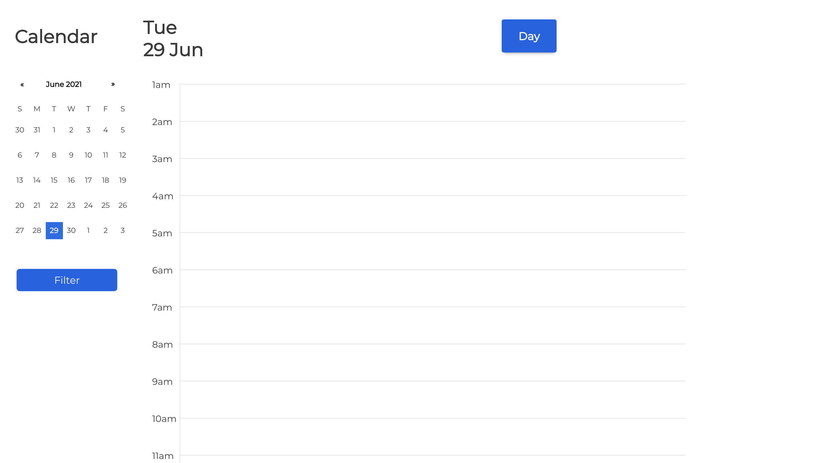

# Cloned the layout of google calendar

## Tech Stack: 
<ul>
<li>React</li>
<li>Express.js</li>
<li>Node.js</li>
<li>MongoDB</li>
<li>Moment.js</li>
</ul>

### Features: 
<ol>
<li>Add schedules</li>
<li>Persistence of schedules using backend</li>
<li>Week View</li>
<li>Day View</li>
</ol>

### Future Enhancement: 

<ul>
<li>Add authentication and more features</li>
</ul>

### Preview: 

